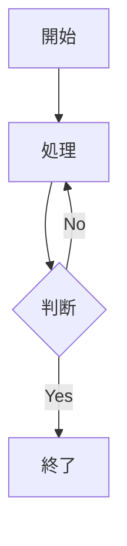

# 機能仕様書: Chiranoura Blog

このドキュメントでは、GatsbyからNext.jsへの移行で計画されている機能強化の詳細を説明します。

---

## 目次

1. [コア機能](#コア機能)
2. [コンテンツ構造](#コンテンツ構造)
3. [インタラクティブコンポーネント](#インタラクティブコンポーネント)
4. [学習機能](#学習機能)
5. [GitHub連携](#github連携)
6. [ビジュアル強化](#ビジュアル強化)

---

## コア機能

### 1. 多言語対応 (i18n)

**動機:** 技術記事を書きながら英語学習も兼ねる。

**要件:**
- 記事は日本語のみ、英語のみ、または両言語対応
- ヘッダーに言語切り替えUI
- 記事の日英版で同じスラッグを使用
- 翻訳が存在しない場合の適切な処理

**URL構造:**
```
/ja/                          → 日本語トップページ
/en/                          → 英語トップページ
/ja/posts/aws-s3-setup        → 日本語記事
/en/posts/aws-s3-setup        → 英語記事（同じスラッグ）
/ja/category/tech             → 日本語カテゴリページ
/en/tags/react                → 英語タグページ
/ja/series/learn-rust         → 日本語シリーズページ
```

**言語切り替えの動作:**
- 翻訳が存在する場合: 言語切り替えの有効なリンク
- 翻訳が存在しない場合: グレーアウトまたは「翻訳作成中」バッジ表示
- 言語切り替え時に現在のパス構造を維持

---

### 2. コンテンツ組織化

#### ナビゲーション階層

**カテゴリ** (記事ごとに1つ)
- 記事ごとに1つのカテゴリ（例: Tech, Diary, Portfolio）
- グローバルナビゲーション（ヘッダー/サイドバー）に表示
- 主要なコンテンツ分類を表す

**タグ** (記事ごとに複数可)
- 複数のタグが可能（例: React, AWS, Algorithm）
- 記事末尾またはサイドバーに表示
- 発見のためのタグクラウドビュー
- コンテキストナビゲーションに使用

**シリーズ** (記事ごとに1つ、任意)
- 記事は1つのシリーズに属することが可能
- シリーズには順序がある（`seriesOrder` フィールド）
- 専用のシリーズ一覧ページ
- シリーズ内での前/次ナビゲーション

#### Frontmatter構造

```typescript
type Frontmatter = {
  title: string;           // 記事タイトル
  date: string;            // YYYY-MM-DD
  lang: 'ja' | 'en';       // 言語
  slug: string;            // 日英共通のスラッグ
  category: string;        // 1つのカテゴリ
  tags: string[];          // 複数のタグ
  series?: string;         // 任意のシリーズID
  seriesOrder?: number;    // シリーズ内の順番 (1, 2, 3...)
  published: boolean;      // 公開ステータス
};
```

---

## インタラクティブコンポーネント

### 1. アルゴリズム可視化

**目的:** ソート、探索、データ構造アルゴリズムをリアルタイムで可視化。

**機能:**
- Canvas/SVGでのアルゴリズム実行のレンダリング
- ステップ実行コントロール（再生、一時停止、進む/戻る）
- 速度調整スライダー
- カスタムデータのユーザー入力
- 現在の操作の視覚的ハイライト

**MDXでの使用:**
```mdx
<Visualizer
  type="bubble-sort"
  data={[5, 2, 8, 1, 9]}
  speed={500}
/>
```

**アルゴリズムタイプ:**
- ソート: バブル、クイック、マージ、ヒープ
- 探索: 二分探索、DFS、BFS
- データ構造: スタック、キュー、木の走査
- グラフアルゴリズム: ダイクストラ、クラスカル、プリム

---

### 2. スクロール連動コード解説 (Scrollytelling)

**目的:** コードのハイライトと解説テキストを同期。

**レイアウト:**
- デスクトップ: 分割ビュー（解説左、コード右）
- モバイル: 積み重ね（解説上、コード下）
- ユーザーがスクロールするとコードセクションが固定/スティッキー

**動作:**
- 解説テキストをスクロール
- 対応するコード行が自動ハイライト
- 変数の値が動的に更新可能
- スムーズなトランジション

**実装:**
- スクロール検出に `IntersectionObserver`
- アニメーションに `framer-motion`
- 動的props: `<CodeBlock highlightedLines={[5, 6, 7]} />`

---

### 3. フラッシュカードシステム (Anki連携)

**目的:** 技術概念の間隔反復学習を可能に。

**UIコンポーネント:**

```mdx
<Flashcard>
  <FlashcardFront>
    クイックソートの最悪時間計算量は？
  </FlashcardFront>
  <FlashcardBack>
    **O(n²)**

    ピボットが常に最小/最大値の場合に発生。
    例: 既にソート済みの配列で先頭要素をピボットにする場合。
  </FlashcardBack>
</Flashcard>
```

**機能:**
- クリック/タップでカードを反転
- 視覚的な反転アニメーション
- 両面でコード、数式（LaTeX）、画像をサポート
- 穴埋め削除サポート: `{{c1::answer}}`

---

### 4. インタラクティブ・プレイグラウンド

**目的:** 読者がコード例を変更して実行できる。

**機能:**
- シンタックスハイライト付きライブコードエディタ
- 即座の実行/可視化
- 入力コントロール（スライダー、テキスト入力）
- 出力表示エリア
- デフォルトにリセットボタン

**使用例:**
- アルゴリズムパラメータの調整
- データ構造操作
- バイナリ演算の可視化
- メモリ割り当てシミュレーション

---

## 学習機能

### 1. Anki CSVエクスポート

**ボタン配置:**
- 記事フッターのフローティングボタン
- アイコン: 🗂️ 「Ankiデッキをダウンロード」

**機能:**
- 現在の記事からすべての `<Flashcard>` コンポーネントを収集
- Ankiインポート互換のCSVを生成
- カード内のHTMLフォーマットをサポート
- 記事タグをAnkiタグ列に自動追加

**CSV形式:**
```csv
"Front","Back","Tags"
"質問HTML","回答HTML","Algorithm,QuickSort,C++"
```

**高度な機能:**
- 穴埋め削除形式: `{{c1::隠しテキスト}}`
- シンタックスハイライト付きコードブロックを含む
- LaTeX数式をサポート
- 記事frontmatterからのタグ自動継承

---

### 2. 進捗追跡 (将来実装)

**将来実装のアイデア:**
- 記事を「既読」としてマーク
- フラッシュカードレビュー履歴の追跡
- 弱点トピックに基づく関連記事の提案
- 学習ストリークの追跡

---

## GitHub連携

### 1. 記事ソースリンク

**目的:** 透明性とコミュニティ貢献。

**記事下部に表示するコンポーネント:**

#### Historyリンク
```
URL: https://github.com/iray-tno/chiranoura-blog/commits/main/posts/[slug]/index.[lang].md
アイコン: 📜
ラベル: "History"
目的: この記事への全変更履歴を確認
```

#### Blameリンク
```
URL: https://github.com/iray-tno/chiranoura-blog/blame/main/posts/[slug]/index.[lang].md
アイコン: 🔍
ラベル: "Blame"
目的: 行ごとの著者とタイムスタンプを確認
```

#### Editリンク (任意)
```
URL: https://github.com/iray-tno/chiranoura-blog/edit/main/posts/[slug]/index.[lang].md
アイコン: ✏️
ラベル: "編集を提案"
目的: PR用のGitHub Webエディタを開く
```

### 2. Issue報告

**誤字/エラー報告:**

```
URL: https://github.com/iray-tno/chiranoura-blog/issues/new?
     template=typo_report.md&
     title=[Typo] 記事タイトル&
     body=記事URL: ...
```

**Issueテンプレート** (`.github/ISSUE_TEMPLATE/typo_report.md`):
```markdown
---
name: 誤字・脱字の報告
about: 記事内の誤字や間違いを報告してください
title: "[Typo] "
labels: typo
assignees: iray-tno
---

**対象記事:**
**誤字の箇所:**
**現在のテキスト:**
**修正案:**
```

**利点:**
- 読者が貢献しやすい低いハードル
- 記事が積極的にメンテナンスされていることを示す
- コミュニティエンゲージメントの構築

---

## ビジュアル強化

### 1. バイナリ/Hexビューアー

**目的:** 低レベルコンテンツの可視化（ファイル形式、メモリダンプ）。

**機能:**
- Hexエディタスタイルレイアウト:
  ```
  Address  | 00 01 02 03 04 05 06 07 | ASCII
  00000000 | 7F 45 4C 46 02 01 01 00 | .ELF....
  ```
- バイトの意味のホバーツールチップ
- エンディアン切り替え（リトル/ビッグ）
- 注釈付きバイト範囲ハイライト

**使用:**
```mdx
<HexViewer
  data={fileBytes}
  annotations={[
    { offset: 0, length: 4, label: "ELFマジックナンバー" }
  ]}
/>
```

---

### 2. アセンブリ/ソース比較

**目的:** C/C++/Rustコードとコンパイルされたアセンブリを並べて表示。

**レイアウト:**
- 分割ビュー: ソース（左） | アセンブリ（右）
- 双方向ハイライト
- ソース行にホバー → アセンブリブロックをハイライト
- アセンブリにホバー → ソース行をハイライト

**データソース:**
- Compiler Explorer (Godbolt) で事前生成
- 記事にJSON マッピングファイルを含む
- インタラクティブ性のためのクライアントサイドレンダリング

**例:**
```mdx
<CompilerExplorer
  source="main.c"
  assembly="main.s"
  mapping="mapping.json"
/>
```

---

### 3. ダイアグラムサポート (Mermaid)

**目的:** テキスト形式でバージョン管理可能なダイアグラム。

**画像に対する利点:**
- テキストベース（Git フレンドリー）
- ライト/ダークテーマに自動適応
- 外部ツールなしで編集可能
- どのズームレベルでも鮮明なレンダリング

**サポートされるダイアグラム:**
- フローチャート
- シーケンス図
- クラス図
- 状態図
- グラフ構造

**実装:**
- `rehype-mermaid` プラグイン
- ビルド時にSVGにレンダリング
- HTMLに直接埋め込み

**使用:**
````mdx

````

---

## コンポーネントライブラリ構造

### 提案ディレクトリレイアウト

```
components/
├── mdx/
│   ├── Flashcard.tsx
│   ├── FlashcardFront.tsx
│   ├── FlashcardBack.tsx
│   ├── Visualizer.tsx
│   ├── CodeBlock.tsx
│   ├── HexViewer.tsx
│   ├── CompilerExplorer.tsx
│   └── Cloze.tsx
├── article/
│   ├── ArticleActionButtons.tsx    # GitHubリンク
│   ├── AnkiExportButton.tsx
│   ├── LanguageSwitcher.tsx
│   ├── SeriesNavigation.tsx
│   └── TagList.tsx
└── layout/
    ├── Header.tsx
    ├── Footer.tsx
    └── Navigation.tsx
```

---

## 実装優先順位

### Phase 4.1: 必須機能
1. Flashcardコンポーネント（基本的な反転カード）
2. Anki CSVエクスポートボタン
3. GitHub連携リンク（History, Blame, Issue）
4. シリーズナビゲーションコンポーネント

### Phase 4.2: ビジュアルコンポーネント
1. コピーボタン付きシンタックスハイライト
2. 数式レンダリング（KaTeX）
3. Mermaidダイアグラムサポート
4. コードブロック強化

### Phase 4.3: インタラクティブ機能
1. 基本アルゴリズム可視化（バブルソート）
2. 可視化タイプの拡張
3. スクロール連動解説
4. インタラクティブ・プレイグラウンド

### Phase 4.4: 高度な機能
1. バイナリ/Hexビューアー
2. アセンブリ/ソース比較
3. 穴埋め削除サポート
4. 進捗追跡

---

## 技術的考慮事項

### パフォーマンス
- ビルド時のコードハイライト（ランタイムではない）
- 重いコンポーネントの遅延ロード
- すべてのルートの静的生成
- `next-image-export-optimizer` での画像最適化

### アクセシビリティ
- フラッシュカードのキーボードナビゲーション
- インタラクティブコンポーネントのARIAラベル
- 可視化のフォーカス管理
- コードテーマの色コントラスト

### SEO
- 言語ごとの適切なメタタグ
- ソーシャルシェア用OGP画像
- 記事用の構造化データ（JSON-LD）
- 言語代替付きサイトマップ生成

---

## 関連ドキュメント

- `PROJECT_DESIGN.md` - 全体的な移行戦略
- `PROJECT_DESIGN.ja.md` - 移行戦略（日本語版）
- `workflow.md` - 開発ワークフロー
- 個別コンポーネントREADME（`components/` 内に作成予定）

---

**最終更新:** 2026-01-02
