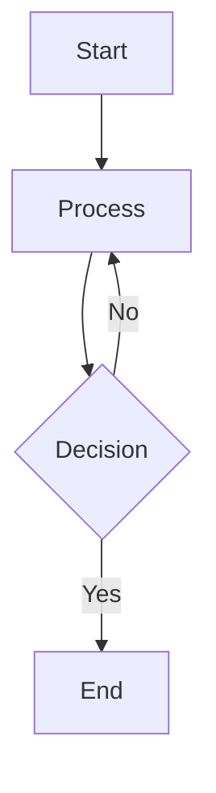

# Feature Specifications: Chiranoura Blog

This document details the functional enhancements planned for the blog migration from Gatsby to Next.js.

---

## Table of Contents

1. [Core Features](#core-features)
2. [Content Structure](#content-structure)
3. [Interactive Components](#interactive-components)
4. [Learning Features](#learning-features)
5. [GitHub Integration](#github-integration)
6. [Visual Enhancements](#visual-enhancements)

---

## Core Features

### 1. Bilingual Support (i18n)

**Motivation:** Learn English while writing technical content.

**Requirements:**
- Articles can be Japanese-only, English-only, or bilingual
- Language switching UI in header
- Same slug for both language versions of an article
- Graceful handling when translation doesn't exist

**URL Structure:**
```
/ja/                          → Japanese top page
/en/                          → English top page
/ja/posts/aws-s3-setup        → Japanese article
/en/posts/aws-s3-setup        → English article (same slug)
/ja/category/tech             → Japanese category page
/en/tags/react                → English tag page
/ja/series/learn-rust         → Japanese series page
```

**Language Switcher Behavior:**
- If translation exists: Active link to switch language
- If translation doesn't exist: Grayed out or show "Translation in progress" badge
- Preserves current path structure when switching

---

### 2. Content Organization

#### Navigation Hierarchy

**Categories** (Single per article)
- One category per article (e.g., Tech, Diary, Portfolio)
- Displayed in global navigation (header/sidebar)
- Represents main content classification

**Tags** (Multiple per article)
- Multiple tags allowed (e.g., React, AWS, Algorithm)
- Displayed at article end or sidebar
- Tag cloud view for discovery
- Used for contextual navigation

**Series** (Single per article, optional)
- Articles can belong to one series
- Series have order (`seriesOrder` field)
- Dedicated series listing pages
- Previous/Next navigation within series

#### Frontmatter Structure

```typescript
type Frontmatter = {
  title: string;           // Article title
  date: string;            // YYYY-MM-DD
  lang: 'ja' | 'en';       // Language
  slug: string;            // Common slug for both languages
  category: string;        // Single category
  tags: string[];          // Multiple tags
  series?: string;         // Optional series ID
  seriesOrder?: number;    // Order within series (1, 2, 3...)
  published: boolean;      // Publication status
};
```

---

## Interactive Components

### 1. Algorithm Visualizer

**Purpose:** Visualize sorting, searching, and data structure algorithms in real-time.

**Features:**
- Canvas/SVG rendering of algorithm execution
- Step-by-step controls (play, pause, step forward/back)
- Speed adjustment slider
- User input for custom data
- Visual highlighting of current operation

**Usage in MDX:**
```mdx
<Visualizer
  type="bubble-sort"
  data={[5, 2, 8, 1, 9]}
  speed={500}
/>
```

**Algorithm Types:**
- Sorting: Bubble, Quick, Merge, Heap
- Searching: Binary search, DFS, BFS
- Data structures: Stack, Queue, Tree traversal
- Graph algorithms: Dijkstra, Kruskal, Prim

---

### 2. Scroll-Linked Code Explanation (Scrollytelling)

**Purpose:** Synchronize code highlighting with explanation text.

**Layout:**
- Desktop: Split view (explanation left, code right)
- Mobile: Stacked (explanation top, code bottom)
- Code section sticky/fixed as user scrolls

**Behavior:**
- Scroll through explanation text
- Corresponding code lines auto-highlight
- Variable values can update dynamically
- Smooth transitions

**Implementation:**
- `IntersectionObserver` for scroll detection
- `framer-motion` for animations
- Dynamic props: `<CodeBlock highlightedLines={[5, 6, 7]} />`

---

### 3. Flashcard System (Anki Integration)

**Purpose:** Enable spaced repetition learning for technical concepts.

**UI Components:**

```mdx
<Flashcard>
  <FlashcardFront>
    What is the worst-case time complexity of QuickSort?
  </FlashcardFront>
  <FlashcardBack>
    **O(n²)**

    Occurs when pivot is always min/max value.
    Example: Already sorted array with first element as pivot.
  </FlashcardBack>
</Flashcard>
```

**Features:**
- Click/tap to flip card
- Visual flip animation
- Support for code, math (LaTeX), images in both sides
- Cloze deletion support: `{{c1::answer}}`

---

### 4. Interactive Playground

**Purpose:** Readers can modify and run code examples.

**Features:**
- Live code editor with syntax highlighting
- Immediate execution/visualization
- Input controls (sliders, text inputs)
- Output display area
- Reset to default button

**Use Cases:**
- Algorithm parameter tweaking
- Data structure operations
- Binary operations visualization
- Memory allocation simulation

---

## Learning Features

### 1. Anki CSV Export

**Button Location:**
- Floating button in article footer
- Icon: 🗂️ "Download Anki Deck"

**Functionality:**
- Collects all `<Flashcard>` components from current article
- Generates CSV compatible with Anki import
- Supports HTML formatting in cards
- Auto-adds article tags to Anki tags column

**CSV Format:**
```csv
"Front","Back","Tags"
"Question HTML","Answer HTML","Algorithm,QuickSort,C++"
```

**Advanced Features:**
- Cloze deletion format: `{{c1::hidden text}}`
- Include code blocks with syntax highlighting
- Support LaTeX math expressions
- Automatic tag inheritance from article frontmatter

---

### 2. Progress Tracking (Future)

**Ideas for future implementation:**
- Mark articles as "read"
- Track flashcard review history
- Suggest related articles based on weak topics
- Learning streak tracking

---

## GitHub Integration

### 1. Article Source Links

**Purpose:** Transparency and community contribution.

**Components to display at article bottom:**

#### History Link
```
URL: https://github.com/iray-tno/chiranoura-blog/commits/main/posts/[slug]/index.[lang].md
Icon: 📜
Label: "History"
Purpose: See all changes to this article over time
```

#### Blame Link
```
URL: https://github.com/iray-tno/chiranoura-blog/blame/main/posts/[slug]/index.[lang].md
Icon: 🔍
Label: "Blame"
Purpose: See line-by-line authorship and timestamps
```

#### Edit Link (Optional)
```
URL: https://github.com/iray-tno/chiranoura-blog/edit/main/posts/[slug]/index.[lang].md
Icon: ✏️
Label: "Suggest Edit"
Purpose: Opens GitHub web editor for PRs
```

### 2. Issue Reporting

**Typo/Error Reporting:**

```
URL: https://github.com/iray-tno/chiranoura-blog/issues/new?
     template=typo_report.md&
     title=[Typo] Article Title&
     body=Article URL: ...
```

**Issue Template** (`.github/ISSUE_TEMPLATE/typo_report.md`):
```markdown
---
name: Typo/Error Report
about: Report typos or mistakes in articles
title: "[Typo] "
labels: typo
assignees: iray-tno
---

**Article URL:**
**Location:**
**Current text:**
**Suggested correction:**
```

**Benefits:**
- Low barrier for readers to contribute
- Shows article is actively maintained
- Builds community engagement

---

## Visual Enhancements

### 1. Binary/Hex Viewer

**Purpose:** Low-level content visualization (file formats, memory dumps).

**Features:**
- Hex editor style layout:
  ```
  Address  | 00 01 02 03 04 05 06 07 | ASCII
  00000000 | 7F 45 4C 46 02 01 01 00 | .ELF....
  ```
- Hoverable tooltips for byte meanings
- Endianness toggle (little/big)
- Byte range highlighting with annotations

**Usage:**
```mdx
<HexViewer
  data={fileBytes}
  annotations={[
    { offset: 0, length: 4, label: "ELF Magic Number" }
  ]}
/>
```

---

### 2. Assembly/Source Comparison

**Purpose:** Show C/C++/Rust code alongside compiled assembly.

**Layout:**
- Split view: Source (left) | Assembly (right)
- Bi-directional highlighting
- Hover source line → highlight assembly block
- Hover assembly → highlight source line

**Data Source:**
- Pre-generated via Compiler Explorer (Godbolt)
- JSON mapping file included in article
- Client-side rendering for interactivity

**Example:**
```mdx
<CompilerExplorer
  source="main.c"
  assembly="main.s"
  mapping="mapping.json"
/>
```

---

### 3. Diagram Support (Mermaid)

**Purpose:** Version-controlled diagrams in text format.

**Advantages over images:**
- Text-based (Git-friendly)
- Auto-adapts to light/dark theme
- Editable without external tools
- Crisp rendering at any zoom level

**Supported Diagrams:**
- Flowcharts
- Sequence diagrams
- Class diagrams
- State diagrams
- Graph structures

**Implementation:**
- `rehype-mermaid` plugin
- Renders at build time to SVG
- Embedded directly in HTML

**Usage:**
````mdx

````

---

## Component Library Structure

### Proposed Directory Layout

```
components/
├── mdx/
│   ├── Flashcard.tsx
│   ├── FlashcardFront.tsx
│   ├── FlashcardBack.tsx
│   ├── Visualizer.tsx
│   ├── CodeBlock.tsx
│   ├── HexViewer.tsx
│   ├── CompilerExplorer.tsx
│   └── Cloze.tsx
├── article/
│   ├── ArticleActionButtons.tsx    # GitHub links
│   ├── AnkiExportButton.tsx
│   ├── LanguageSwitcher.tsx
│   ├── SeriesNavigation.tsx
│   └── TagList.tsx
└── layout/
    ├── Header.tsx
    ├── Footer.tsx
    └── Navigation.tsx
```

---

## Implementation Priority

### Phase 4.1: Essential Features
1. Flashcard component (basic flip card)
2. Anki CSV export button
3. GitHub integration links (History, Blame, Issue)
4. Series navigation component

### Phase 4.2: Visual Components
1. Syntax highlighting with copy button
2. Math rendering (KaTeX)
3. Mermaid diagram support
4. Code block enhancements

### Phase 4.3: Interactive Features
1. Basic algorithm visualizer (bubble sort)
2. Expandable visualizer types
3. Scroll-linked explanations
4. Interactive playgrounds

### Phase 4.4: Advanced Features
1. Binary/Hex viewer
2. Assembly/source comparison
3. Cloze deletion support
4. Progress tracking

---

## Technical Considerations

### Performance
- Code highlighting at build time (not runtime)
- Lazy load heavy components
- Static generation for all routes
- Optimize images with `next-image-export-optimizer`

### Accessibility
- Keyboard navigation for flashcards
- ARIA labels for interactive components
- Focus management in visualizers
- Color contrast for code themes

### SEO
- Proper meta tags per language
- OGP images for social sharing
- Structured data (JSON-LD) for articles
- Sitemap generation with language alternates

---

## Related Documents

- `PROJECT_DESIGN.md` - Overall migration strategy
- `workflow.md` - Development workflow
- Individual component READMEs (to be created in `components/`)

---

**Last Updated:** 2026-01-02
